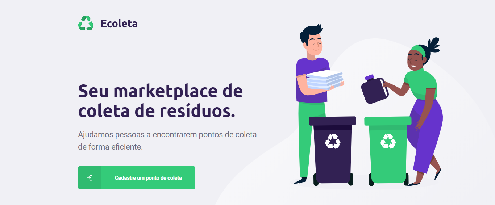
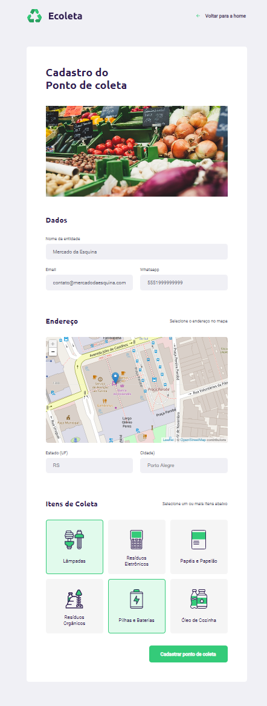
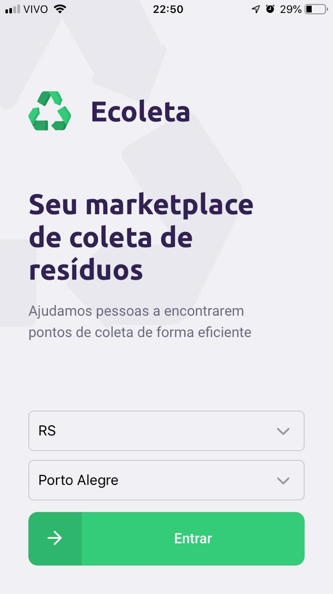
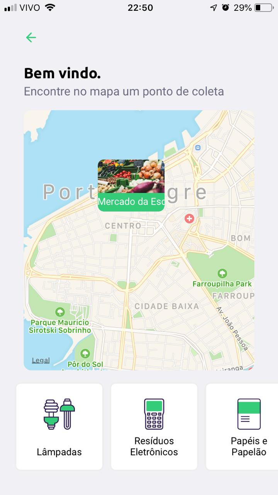
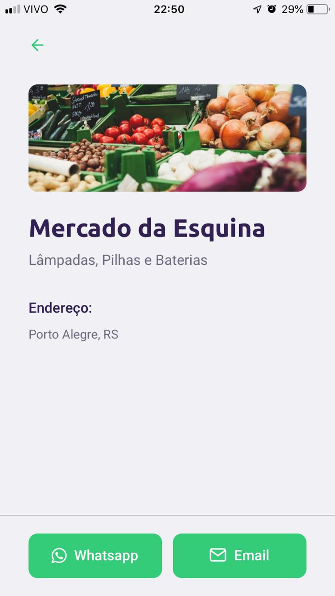

# Ecoleta ♻️

Application for companies which collect recyclable materials to register, so that people in need of those companies can find them easily.

This application was developed through the [Rocketseat](https://rocketseat.com.br/) NLW #01, but with some big changes from the proposed project on the Backend part, using Serverless technologies.

## Architeture 📐

Everything is built using [Typescript](https://www.typescriptlang.org/), from the backend, through the Desktop and Mobile application.

Everything is deployed automatically using [Github Actions](https://github.com/features/actions), when we push to the master branch at [Github](https://github.com).

### Backend 💾

This application backend is built with serverless technologies (and [Serverless](https://www.serverless.com/) framework), more specifically on top of [AWS](https://aws.amazon.com/), namely:

* [AWS Lambda](https://aws.amazon.com/lambda/), for code execution;
* [AWS DynamoDB](https://aws.amazon.com/dynamodb/), for long term storage;
* [AWS S3](https://aws.amazon.com/s3/), for storing images and assets.

The backend is queried both from the web frontend and the mobile app through a common interface, resulting in a general API.

### Web Frontend 💾

A simple React application, responsible for the application data input. Props to some of the awesome technologies used:

* [Dropzone](https://www.dropzonejs.com/) with [Dropzone React](https://react-dropzone.js.org/)
* [Leaflet](https://leafletjs.com/) with [Leaflet React](https://react-leaflet.js.org/)

### Mobile app 📱

[React Native](https://reactnative.dev/) Typescript mobile app, built using [Expo](https://expo.io/) for local testing (and some awesome extra libraries). Responsible for displaying the information registered through the web form.

## Screenshots 📷

### Desktop

### Mobile

## Todo 🔮

* Deploy on production with Github Actions (Vercel + Lambda + Dynamo + S3)
* Change to another business rule, so that it is not exactly the same as presented during NLW #01

## Author 🧔

* [RafaAudibert](https://rafaaudibert.dev)
